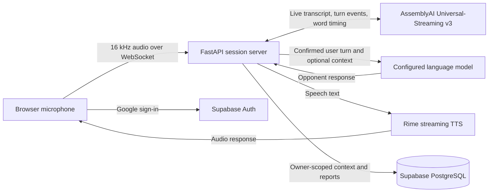

<h1 align="center">Miles</h1>

<p align="center"><strong>Practice difficult conversations before they matter.</strong></p>

<p align="center">
  A real-time voice sparring partner built for the
  <a href="https://lablab.ai/ai-hackathons/assemblyai-voice-agent-hackathon">2026 AssemblyAI Voice Agent Hackathon</a>.
</p>

<p align="center">AssemblyAI Universal-Streaming v3 · FastAPI · React · Rime</p>

Miles helps people rehearse pitches, negotiations, interviews, sales objections, cross-examinations, crisis responses, boardroom challenges, and custom debates. Speak with an AI opponent, interrupt it naturally, then review a report grounded in the session transcript and measured speech signals.

## Why AssemblyAI

Miles uses AssemblyAI Universal-Streaming v3 for live transcription. Its FastAPI service streams microphone audio to AssemblyAI and uses partial and final turns, speech-start events, and word timing in the sparring loop and report.

This is a custom voice stack, not the single-connection AssemblyAI Voice Agent API: Miles manages turn-taking and interruption, sends confirmed turns to a configured language model, and uses Rime for speech output. The hackathon supports different approaches to building with AssemblyAI.

See the [official hackathon](https://lablab.ai/ai-hackathons/assemblyai-voice-agent-hackathon) and AssemblyAI's [Streaming v3 guide](https://www.assemblyai.com/docs/streaming/guides/v2_to_v3_migration).

## How a session works

1. Choose one of eight scenarios or enter a custom debate topic.
2. Optionally add context such as a PDF or notes.
3. Check the microphone and speakers, then practice aloud with Miles.
4. Finish the session to review transcript-grounded feedback, download a PDF, or explicitly create a share link.



## What is in the current release

- **Eight practice scenarios:** VC pitch, salary negotiation, cross-examination, senior interview, sales objections, media crisis, boardroom challenge, and custom debate.
- **Real-time voice practice:** AssemblyAI streaming transcription, scenario vocabulary, turn handling, interruption support, and Rime speech output.
- **Useful debriefs:** transcript-backed examples, measured speech signals, PDF export, and user-initiated report sharing. Short sessions and unavailable evaluations are labelled honestly; unsupported argument scores are not invented.
- **Optional context:** add supported documents or notes to give a practice session more detail. Google Drive can import supported files from public links or after you approve private-file access, and can export a finished PDF report when configured.
- **Google sign-in:** Google is the only sign-in method in this release, through Supabase Auth. Email-code login is not enabled. Google Drive access uses a separate, optional consent flow.
- **Meeting integrations:** Google Calendar, Google Meet, and Recall.ai bot workflows remain in the repository but are hidden and disabled by default in this sparring-only release.

## Stack and repository map

| Area | Technology |
| --- | --- |
| Frontend | React, TypeScript, Vite |
| API and live sessions | Python 3.12+, FastAPI, WebSockets |
| Speech recognition | AssemblyAI Universal-Streaming v3 |
| Speech output | Rime streaming TTS |
| Opponent and evaluation | Configurable OpenAI, Gemini, or Anthropic provider |
| Authentication and production data | Supabase Auth and PostgreSQL |
| Frontend hosting | Vercel; the API runs separately on an ASGI host that supports long-lived WebSockets |

```text
Application/
  src/api/        FastAPI routes and WebSocket session
  src/voice/      AssemblyAI, Rime, and interruption handling
  src/debate/     Opponent, transcript, and debrief logic
  src/context/    Context extraction and storage
  src/meeting/    Calendar and Recall.ai integrations (disabled by default)
  src/storage/    PostgreSQL stores and legacy JSON import
  frontend/       React and TypeScript app
  tests/          Backend tests
  docs/           Authentication, storage, meeting, and release notes
docs/             Historical hackathon design notes
```

## Run locally

### Requirements

- Python 3.12 or newer
- Node.js and npm
- Provider credentials for live voice practice

### 1. Configure the backend

From the repository root:

```bash
cd Application
python -m venv .venv
```

Activate the environment (`.venv\Scripts\Activate.ps1` in Windows PowerShell, or `source .venv/bin/activate` on macOS/Linux), then install and create the local environment file:

```bash
python -m pip install -e '.[dev]'
cp .env.example .env
```

For a live sparring session, set `ASSEMBLYAI_API_KEY`, `RIME_API_KEY`, and one language-model key (`OPENAI_API_KEY`, `GEMINI_API_KEY`, or `ANTHROPIC_API_KEY`) in `Application/.env`.

Start the API:

```bash
python main.py
```

It listens on `http://localhost:8000` by default; set `PORT` to use a different port.

### 2. Configure and start the frontend

In a second terminal, from the repository root:

```bash
cd Application/frontend
npm ci
cp .env.example .env.local
npm run dev
```

Open `http://localhost:5173`. Set the Supabase values in both environment files and configure its Google provider and `/auth/callback` URL to test sign-in. See the [authentication guide](Application/docs/authentication.md).

Local development can use JSON storage when `DATABASE_URL` is unset; it defaults to `Application/data/` and can be moved with `MILES_DATA_DIR`. A configured Supabase project is still required for Google sign-in. Never commit `.env` or `.env.local` files, and never put a Supabase service-role key or provider secret in a `VITE_` variable.

## Run checks

From `Application/`:

```bash
pytest -q
```

From `Application/frontend/`:

```bash
npm test
npm run build
```

These checks use test doubles and do not verify browser microphone playback or hosted provider access.

Live provider checks are optional and can use provider quota:

```bash
python scripts/provider_smoke_check.py --live
python scripts/verify_demo_flow.py --live
```

The synthetic demo flow exercises all scenarios and report/PDF generation. For one longer pitch run:

```bash
python scripts/verify_demo_flow.py --live --scenario vc_pitch --turns 3 --output data/demo-full-round-results.json
```

`python benchmark_interruption.py --live` measures simulated server-side cancellation response. It does not measure microphone detection, browser playback buffers, or end-to-end audible cut-off; see the [Rime evidence notes](Application/RIME_EVIDENCE.md).

## Deployment notes

- **Frontend:** the root [`vercel.json`](vercel.json) builds the Vite app in `Application/frontend/`.
- **API:** the root [`Dockerfile`](Dockerfile) starts `Application/main.py`. Use an ASGI host that supports persistent WebSocket connections. Active voice sessions are process-local, so run one backend process until shared session coordination is added.
- **Database:** production user data uses Supabase PostgreSQL. Apply the migration and use the restricted runtime role described in the [storage guide](Application/docs/data-storage.md).
- **Meet bots:** the default frontend and backend flags are off. Do not treat Calendar, Meet, or Recall.ai bot launching as enabled in the hackathon build.

## Project guides

| Guide | What it covers |
| --- | --- |
| [Hackathon demo](EXAMINER_GUIDE.md) | Suggested walkthrough and what to show judges |
| [Release verification](Application/docs/hackathon-release-verification-2026-09-30.md) | Dated test evidence and known verification boundaries |
| [Authentication](Application/docs/authentication.md) | Google sign-in and Supabase configuration |
| [Data storage](Application/docs/data-storage.md) | PostgreSQL schema, runtime role, and JSON import |
| [Meeting bot setup](Application/docs/meeting-bot.md) | Retained Recall.ai bridge and setup notes; disabled by default |
| [API and integration notes](Application/CODEX_CONTEXT.md) | Backend/frontend contracts and integration details |
| [Browser guide](Application/FRONTEND_BROWSER_GUIDE.md) | Browser audio and WebSocket reference |
| [AssemblyAI proposal and scenarios](ROADMAP_ASSEMBLYAI.md) | Historical design plan; not a statement of shipped features |

The root `docs/` files and `Application/docs/adr/` include earlier proposals and decisions; some describe plans that have since changed. Use the current source and release notes above for implemented behavior.

## License

There is no `LICENSE` file yet. The repository is public, but reuse terms have not been specified.
